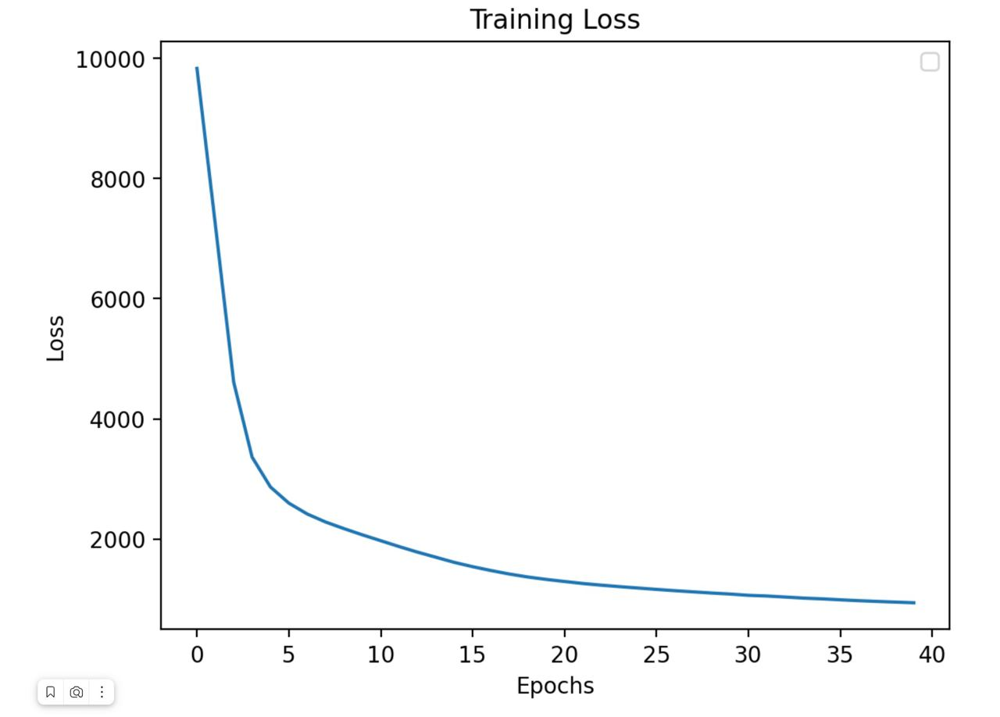
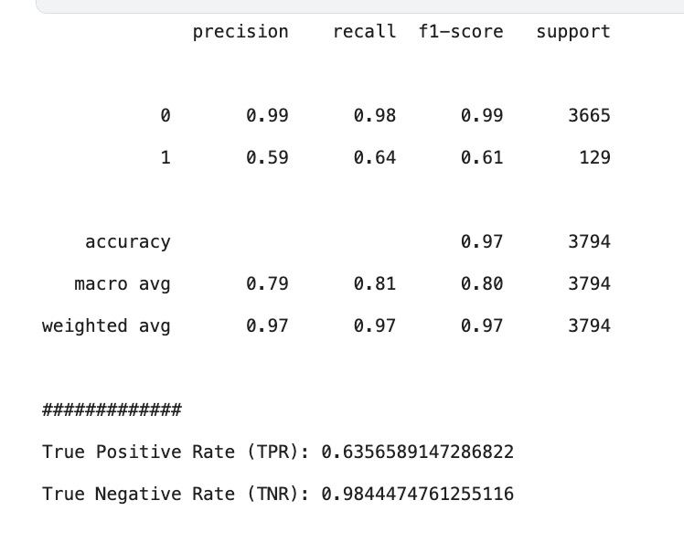

Ссылка на kaggle-ноутбук https://www.kaggle.com/code/rustemx/hw-1-bias-gen-and-autoencoders

## 1) Байесовская генерация

Генерация стилей одежды (а) и картинок (b) на основе частот встречаемости объектов в данных

__Данные__:

a) Исходные данные в виде питонвского словаря

b) Данные из репозитория курса (загрузил на платформу kaggle)

## 2) Автоэнкодеры

__Данные__:

train - картинки непроливов

proliv - картинки проливов

test - картинки проливов и непроливов

* Детекция аномалий с использованием автоэнкодера
Автоенкодер обучается на картинках, где нет проливов. В ходе обучения достигается минимально возможное значение MSE.
Затем обученный автоэнкодер работает с картинками, где есть только проливы. Получается более высокие значения MSE из-ра разности распределения в данных.

* В итоге детекция проливов проивзодилась на основе порога MSE равного 55 (выше среднего MSE достигаемого на датасете проливов)

Полученный график изменения значений лосс функции в ходе обучения

Полученные метрики

