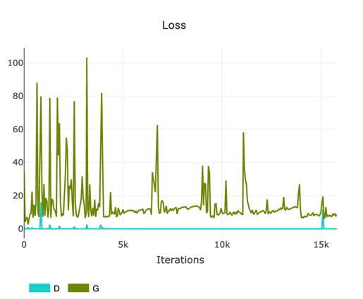
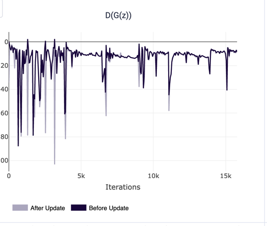
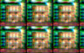
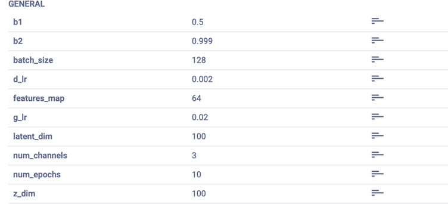

**Задача посвящена генерации лиц с использованием архитектуры GAN**

Ссылка на kaggle-ноутбук https://www.kaggle.com/code/rustemx/implempentation-gan
1. Использовался датасет CelebA на платформе Kaggle, включающий 202599 изображения
2. Для повышения обобщаемой способности генератора реализован CSPup блок , сжимающий изображение и увеличивающий количество каналов в два раза
3. Реализована архитектура GAN, состоящая из дискриминатора и генератора
4. Результаты обучения модели:

Значения функции потерь генератора и дискриминатора в результате обучения:

Пики соответветсвуют неудачным примерам генераций. Видно, что в процессе обучение частота таких пиков снижается, однако значения функции потерь для генератора больше, чем у дискриминатора и обучение не сходится. 

Значения ненормированной вероятности классификации сгенированного изображения замороженным (Before update) и обновленным (After update) генератором:

Близкие значения говорят о том, что дискриминатор классифицирует одинаково хорошо шум как 0 и сгенерированные изображения генератором как 1.

Резко отличающиеся значения говорят о плохом качестве генерации - дискриминатор классифицирует сгенерированные изображения генератором как шум 0.

Пример сгенерированных изображений:

Конфиг параметров обучения модели:

Для упрощения генерации изображения были преобразованы к размерности 64 на 64

В результате обучения модели были получены следующие результаты:
- Смена оптимизатора на AdamW показала лучшие результаты по сравнению с другими оптимизаторами
- Увеличение числа слоев CSPup до 5 привело к улучшению качества генерации изображений
- Были проведены эксперименты с выбором размера пакета (batch_size) и методов нормализации
